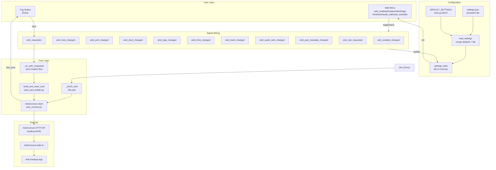
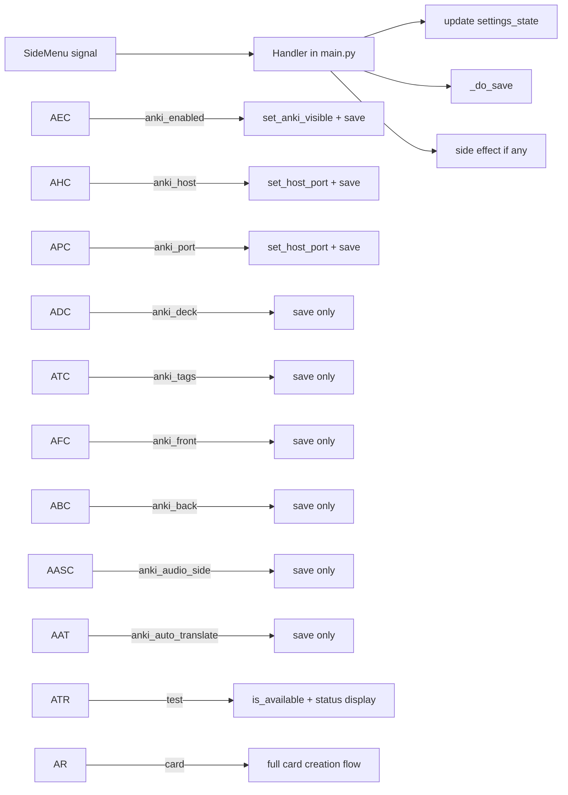
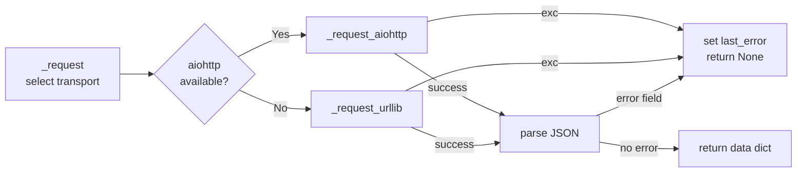

# Anki Integration — Full-Depth Third-Party Audit

**Audit scope:** Entire Anki implementation across all layers: settings persistence, UI configuration, signal wiring, card building, AnkiConnect client, availability polling, error display, documentation.

**Date:** 2026-05-01  
**Previous fixes applied:** #1–#9 (media collisions, tag parsing, stale errors, TTS lock, note type flag, cached translation, transport errors, screenshot encoding, duplicate screenshot)

---

## Architecture Diagram



---

## Layer 1: Settings Persistence

### [`main.py`](../main.py) — settings loading/saving

| Check | Status | Detail |
|-------|--------|--------|
| Default values exist | ✅ | Lines 38-67 define `DEFAULT_SETTINGS` with all 9 Anki keys |
| File load with merge | ✅ | [`load_settings()`](../main.py:72) copies defaults then overlays file values |
| Atomic save | ✅ | [`save_settings()`](../main.py:88) writes to `.tmp` then `replace()` — crash-safe |
| New key migration | ✅ | `load_settings()` iterates over `DEFAULT_SETTINGS` keys, so new keys auto-populate with defaults |

**Finding M1 (Low):** `DEFAULT_SETTINGS` and `settings.json` diverge — this is expected since `settings.json` is the user's actual config. However, if a user deletes `settings.json`, defaults revert to `anki_enabled: False`, `anki_front: "screenshot"`, `anki_audio_side: "front"`, which may surprise them if they're used to the previous values.

**Finding M2 (Low-Medium):** No validation on settings load. If `settings.json` has `anki_port: "abc"` or `anki_host: ""`, these values flow through unchecked until AnkiConnect tries to use them. The `_on_anki_port_finished` handler does validate, but only on UI edit, not on file load.

### [`settings.json`](../settings.json) — actual config

```json
{
  "anki_enabled": true,
  "anki_host": "localhost",
  "anki_port": 8765,
  "anki_deck": "DesktopOCR",
  "anki_tags": "japanese, vn",
  "anki_front": "screenshot_selection",
  "anki_back": "full_with_context",
  "anki_audio_side": "both",
  "anki_auto_translate": true
}
```

All values are valid and consistent with the feature's design.

### [`settings.json.example`](../settings.json.example)

```json
{
  "anki_enabled": false,
  "anki_front": "screenshot",
  "anki_audio_side": "front"
}
```

**Finding M3 (Low):** Example shows `anki_audio_side: "front"` and `anki_front: "screenshot"` but user's actual config uses `"both"` and `"screenshot_selection"`. The example should be a canonical recommended config, not drifted from what actual users have.

---

## Layer 2: UI Configuration — [`ui/side_menu.py`](../ui/side_menu.py)

### Anki section construction (lines 369-471)

| UI Element | Type | Lines | Signal | Validation |
|-----------|------|-------|--------|------------|
| Enable/disable toggle | Toggle pair | 403-408 | `anki_enabled_changed(bool)` | None needed |
| Host | `QLineEdit` | 410-416 | `anki_host_changed(str)` | `.strip()` only |
| Port | `QLineEdit` | 418-424 | → `_on_anki_port_finished` → `anki_port_changed(int)` | `int()` parse with 8765 fallback |
| Deck Name | `QLineEdit` | 426-432 | `anki_deck_changed(str)` | `.strip()` only |
| Tags | `QLineEdit` | 434-440 | `anki_tags_changed(str)` | `.strip()` only |
| Front Template | `QComboBox` | 448-452 | `anki_front_changed(str)` | By index (safe) |
| Back Template | `QComboBox` | 454-458 | `anki_back_changed(str)` | By index (safe) |
| Audio Side | `QComboBox` | 460-464 | `anki_audio_side_changed(str)` | By index (safe) |
| Auto-translate | Toggle pair | 466-471 | `anki_auto_translate_changed(bool)` | None needed |
| Test Connection | `QPushButton` | 443-446 | `anki_test_requested` | None needed |

**Finding U1 (Medium):** No input validation on Host, Deck, or Tags fields. Empty deck name (`""`) would be sent to AnkiConnect's `createDeck` which would fail with an API error. Empty tags is fine. Empty host would try to connect to `http://:8765` which would fail with a transport error. The error would surface via `last_error` → tooltip, but an inline validation + visual indicator (red border) would be better UX.

**Finding U2 (Low-Medium):** Port field uses `editingFinished` + `_on_anki_port_finished` which has proper `int()` coercion. However, if the user types non-numeric input and clicks elsewhere, the port silently defaults to 8765 without any feedback. The user's input is replaced silently.

### Front template combo (line 450)
```python
self._anki_front_combo.addItems(["screenshot", "screenshot_selection", "selection_only"])
```

**Finding U3 (Low):** `anki_card_builder.py` line 142 has an `else` catch-all that defaults to `{Screenshot}` mode. If a new front mode is added to the combo but not to the builder logic, it would silently fall through to screenshot mode. Fragile but not currently broken.

---

## Layer 3: Signal Wiring — [`main.py`](../main.py) event handlers

### Wiring (lines 1094-1157)



| Signal | Handler | Persists? | Side effect | Issue |
|--------|---------|-----------|-------------|-------|
| `anki_enabled_changed` | Line 1095 | ✅ `_do_save()` | `set_anki_visible(enabled)` | ❌ No immediate availability check |
| `anki_host_changed` | Line 1101 | ✅ | `anki.set_host_port()` | ❌ No `last_error` clear, no re-check |
| `anki_port_changed` | Line 1107 | ✅ | `anki.set_host_port()` | ❌ Same as above |
| `anki_deck_changed` | Line 1114 | ✅ | None | — |
| `anki_tags_changed` | Line 1119 | ✅ | None | — |
| `anki_front_changed` | Line 1124 | ✅ | None | — |
| `anki_back_changed` | Line 1129 | ✅ | None | — |
| `anki_audio_side_changed` | Line 1134 | ✅ | None | — |
| `anki_auto_translate_changed` | Line 1139 | ✅ | None | — |
| `anki_test_requested` | Line 1145 | ❌ | Status bar display | — |
| `anki_requested` | Line 1080 | ❌ | Full card creation | Protected by `_anki_busy` flag |

**Finding W1 (Medium):** Host/port change handlers don't clear `last_error` or trigger a re-check. If the user changes from a working host to a broken one, the tray button may still show "available" until the 30s poll cycle catches up. Conversely, changing from a broken host to a working one leaves the stale error visible.

**Finding W2 (Low-Medium):** Toggling Anki on doesn't trigger `_check_anki()`. The button appears but shows stale availability until the next 30s poll. An explicit `asyncio.create_task(_check_anki())` in `_on_anki_enabled_changed` would resolve this.

---

## Layer 4: Availability Polling — [`main.py:966-978`](../main.py:966)

```python
async def _check_anki() -> None:
    if not settings_state.get("anki_enabled", False):
        return
    available = await anki.is_available()
    if available:
        ok = await anki.ensure_note_type()
        if not ok:
            available = False
    if window is not None:
        window.set_anki_available(available, anki.last_error)
```

| Aspect | Status |
|--------|--------|
| Poll interval | ✅ 30 seconds via `QTimer` |
| Immediate first poll | ✅ `asyncio.create_task(_check_anki())` at line 1092 |
| Returns early when disabled | ✅ Line 968 |
| Note type check on every poll | ✅ After Fix #5 |
| Error propagation to UI | ✅ `anki.last_error` flows to tray button tooltip |
| Thread safety | ✅ All async, single-threaded |

**No issues found in this layer.**

---

## Layer 5: Card Building — [`logic/anki_card_builder.py`](../logic/anki_card_builder.py)

### Data flow

```mermaid
flowchart TD
    A[capture.last_frame] -->|cv2.imencode + base64| B[screenshot_b64]
    C[selection_text] -->|strip or fallback| D[target_text]
    E[ocr_text] -->|fallback| D
    D --> F[fields dict\nTargetText/ContextText\nTargetTranslation/ContextTranslation\nScreenshot]
    B --> F
    F --> G[Front HTML build\nmode from config]
    F --> H[Back HTML build\nmode from config]
    G --> I[placeholder substitution\n{Screenshot}→ etc]
    H --> I
    I --> J[assign Front/Back to fields]
    K[audio_paths] -->|base64 encode| L[audio_dicts list]
    L --> M[add_note API call]
    J --> M
    B --> N[picture_dict\nfields=[]]
    N --> M
```

| Step | Code | Status |
|------|------|--------|
| Screenshot capture | Lines 52-70 | ✅ Graceful None, logs warning, continues |
| Empty-text guard | Lines 86-89 | ✅ After Fix #3, sets `last_error` |
| Field assembly | Lines 97-118 | ✅ All 7 fields built correctly |
| Front template | Lines 123-142 | ✅ 4 modes + fallback + screenshot_absent fallback |
| Back template | Lines 147-173 | ✅ 3 modes + fallback |
| Placeholder substitution | Lines 178-187 | ✅ Correct field mapping |
| Audio attachment | Lines 209-238 | ✅ Per-path base64, field routing by idx |
| Picture attachment | Lines 243-253 | ✅ `fields=[]` prevents double `` |
| Tag parsing | Lines 258-259 | ✅ After Fix #2 |
| Deck/model assurance | Lines 267-273 | ✅ Always called, after Fix #5 |
| `add_note` call | Lines 275-281 | ✅ With audio + picture params |

**Finding B1 (Low):** `target_text` is computed twice (line 75 and line 98) via the same expression `(selection_text or "").strip() or (ocr_text or "").strip()`. Minor DRY violation.

**Finding B2 (Low):** Audio field routing logic (line 231: `fields_for_this = audio_fields if idx == 0 else ["Back"]`) is undocumented. Context audio always goes to Back, regardless of `audio_side` setting. This makes semantic sense but should be commented or documented.

---

## Layer 6: AnkiConnect Client — [`logic/anki_connect.py`](../logic/anki_connect.py)

### Request lifecycle



| Method | Transport | Timeout | Error handling | Sets `last_error` |
|--------|-----------|---------|----------------|-------------------|
| `_request_aiohttp` | `aiohttp.ClientSession` | 10s (2s for version poll) | ✅ HTTP status, JSON error, transport exc, JSON decode | ✅ |
| `_request_urllib` | `urllib.request` + executor | Same | ✅ Same coverage | ✅ via direct assignment |
| `is_available` | version action | 2.0s (quiet) | ✅ | ✅ "Anki is not running" |
| `ensure_deck` | createDeck | 10s | ✅ | ✅ context-specific |
| `ensure_note_type` | modelNames + createModel | 10s | ✅ | ✅ context-specific |
| `add_note` | addNote | 10s | ✅ | ✅ context-specific |

**Finding A1 (Medium):** `_request_urllib` directly assigns `self.last_error` (lines 147, 157, 166) without `_set_error`'s lock. The comment claims "direct assignment safe" because `_sync_post` runs in a thread-pool executor. This is technically correct — the executor thread is synchronous and no coroutine is concurrently running. However, it introduces an implicit coupling: if any code path calls `_request_urllib` while a coroutine is mid-flight in `_request_aiohttp`, the `asyncio.Lock()` in `_set_error` would be bypassed. Currently this can't happen since `_request` selects one transport or the other, but it's fragile.

**Finding A2 (Low):** `add_note` line 300-308: The `error` field check is dead code — `_request` already returns `None` when `data["error"] is not None` (line 102-107). So `add_note` will never see a response with an error field. Harmless defensive coding.

### `ensure_note_type` completeness (lines 206-258)

The note type is created with 7 fields, CSS styling, and 1 card template. All fields used by the builder are present:
- Front, Back, TargetText, TargetTranslation, ContextText, ContextTranslation, Screenshot

✅ Complete and correct.

---

## Layer 7: UI Display — [`ui/transcription_tray.py`](../ui/transcription_tray.py)

| Component | Lines | Behavior | Status |
|-----------|-------|----------|--------|
| Anki button | 107-114 | `🃏 Anki`, fixed height, in primary button group | ✅ |
| Availability state | 111-112 | `_anki_available = False` initially | ✅ |
| Error tracking | 112 | `_anki_last_error: str | None = None` | ✅ |
| `set_anki_available()` | 360-366 | Updates tooltip with error or "Save to Anki" | ✅ |
| `_on_anki_clicked()` | 368-377 | Shows `QMessageBox.information` when unavailable | ✅ |
| `set_anki_visible()` | 379-381 | Hide/show the button | ✅ |

**Finding D1 (Medium):** [`get_selection_translation()`](../ui/transcription_tray.py:357) returns `self._trans_text.toPlainText()` — which is the OCR translation, not the selection translation. The method name is misleading. Currently unused for Anki (Fix #6 ensures `cached_translation = None`), but any future caller would get wrong data.

---

## Layer 8: Documentation

### [`docs/user_guide.html`](../docs/user_guide.html) — Card Structure section (lines 254-264)

| Line | Documented | Actual | Match? |
|------|-----------|--------|--------|
| 259 | `TargetText` = raw OCR text | `TargetText` = selection text (or OCR fallback) | ❌ **Swapped** |
| 260 | `TargetTranslation` = translated OCR text | Correct | ✅ |
| 261 | `ContextText` = selected/highlighted text | `ContextText` = full OCR output | ❌ **Swapped** |
| 262 | `ContextTranslation` = translation of selected text | `ContextTranslation` = translation of OCR text | ❌ **Swapped** |

**Finding Doc1 (Medium):** `TargetText` and `ContextText` descriptions are reversed. `TargetText` is selected text (with OCR fallback), `ContextText` is full OCR output. The user guide says the opposite.

**Finding Doc2 (Medium):** [`user_guide.html:250`](../docs/user_guide.html:250) says auto-translate "Falls back to the displayed translation if the API call fails." This is wrong after Fix #6 — `cached_translation = None` deliberately discards the UI translation. There is no fallback.

### [`README.md`](../README.md) — Settings table (lines 58-67)

**Finding Doc3 (Low):** README shows default `anki_audio_side: "front"` but user's `settings.json` has `"both"`. README is technically correct for default, but may confuse users comparing against their actual config.

---

## Layer 9: Security & Safety

| Check | Status | Notes |
|-------|--------|-------|
| Rate limiting | ✅ | `_anki_busy` flag with `try/finally` reset |
| Exception safety | ✅ | All AnkiConnect methods catch `Exception` and never raise |
| Settings file atomicity | ✅ | `tmp + replace()` pattern prevents corruption |
| API key exposure | ✅ (out of scope) | Plaintext in `settings.json` is general app issue, not Anki-specific |

---

## Summary of All Findings

### Medium Severity (should fix)

| ID | Finding | File:Line | Impact |
|----|---------|-----------|--------|
| **M-Doc1** | `TargetText`/`ContextText` descriptions swapped in user guide | [`docs/user_guide.html:259-262`](../docs/user_guide.html:259) | User confusion about card fields |
| **M-Doc2** | Auto-translate fallback claim is outdated | [`docs/user_guide.html:250`](../docs/user_guide.html:250) | Misleading docs |
| **M-D1** | `get_selection_translation()` returns OCR translation | [`ui/transcription_tray.py:357`](../ui/transcription_tray.py:357) | Misleading API, future callers get wrong data |
| **M-U1** | No input validation on Host/Deck/Tags fields | [`ui/side_menu.py:411-440`](../ui/side_menu.py:411) | Empty deck name triggers API error |
| **M-W1** | Host/port change doesn't clear `last_error` or re-check | [`main.py:1101-1112`](../main.py:1101) | Stale availability state after config change |
| **M-W2** | Toggling Anki on doesn't trigger immediate check | [`main.py:1095-1098`](../main.py:1095) | Button appears but may show stale state for up to 30s |
| **M-A1** | `_request_urllib` bypasses `_set_error` lock | [`logic/anki_connect.py:147`](../logic/anki_connect.py:147) | Fragile thread-safety pattern |

### Low Severity (nice to fix)

| ID | Finding | File:Line | Notes |
|----|---------|-----------|-------|
| L-M1 | `DEFAULT_SETTINGS` vs example drift | [`main.py:58-66`](../main.py:58) vs [`settings.json.example`](../settings.json.example) | Confusing for new users |
| L-M2 | No settings load validation | [`main.py:72-85`](../main.py:72) | Bad file data flows unchecked |
| L-M3 | Example default values differ from user config | [`settings.json.example`](../settings.json.example:28-36) | Drift between example and common usage |
| L-U2 | Port silent fallback to 8765 on invalid input | [`ui/side_menu.py:1154-1160`](../ui/side_menu.py:1154) | No user feedback on bad input |
| L-U3 | Front template combo fallback fragile | [`logic/anki_card_builder.py:142`](../logic/anki_card_builder.py:142) | New combo items silently map to screenshot |
| L-B1 | `target_text` expression duplicated | [`logic/anki_card_builder.py:75,98`](../logic/anki_card_builder.py:75) | DRY violation |
| L-B2 | Audio field routing undocumented | [`logic/anki_card_builder.py:231`](../logic/anki_card_builder.py:231) | idx>=1 always to Back |
| L-A2 | `add_note` dead error check | [`logic/anki_connect.py:304-308`](../logic/anki_connect.py:304) | Harmless dead code |
| L-Doc3 | README default values vs actual config | [`README.md:66`](../README.md:66) | Minor documentation drift |

---

## What's Clean

The following areas are well-implemented with no issues found:

- ✅ **Availability polling** — 30s `QTimer` + immediate first poll + error propagation to tooltip
- ✅ **Note type assurance** — Called every poll (+ Fix #5), idempotent, cheap when model exists
- ✅ **Card sending rate limit** — `_anki_busy` flag with `try/finally` reset
- ✅ **Exception safety** — All Anki methods catch `Exception`, never raise to UI
- ✅ **Screenshot handling** — Graceful None, `fields=[]` prevents double ``, microsecond timestamps (+ Fix #1)
- ✅ **Tag parsing** — Comma-split with strip (+ Fix #2)
- ✅ **Empty text guard** — Explicit `last_error` message (+ Fix #3)
- ✅ **TTS concurrency** — Removed `.locked()` shortcut, proper `async with` serialization (+ Fix #4)
- ✅ **Translation isolation** — No cached UI translation in Anki flow (+ Fix #6)
- ✅ **Transport error propagation** — `last_error` set on connection failures (+ Fix #7)
- ✅ **Screenshot encoding** — Correct `buf.tobytes()` order (+ Fix #8)
- ✅ **No duplicate screenshot** — `picture.fields = []` (+ Fix #9)
- ✅ **Settings file safety** — Atomic `tmp + replace()` write pattern
- ✅ **Port field validation** — `int()` parse with 8765 fallback
- ✅ **Test Connection button** — Manual availability check with status bar feedback
- ✅ **Help documentation** — Side menu help tooltip with clear instructions and prerequisites
