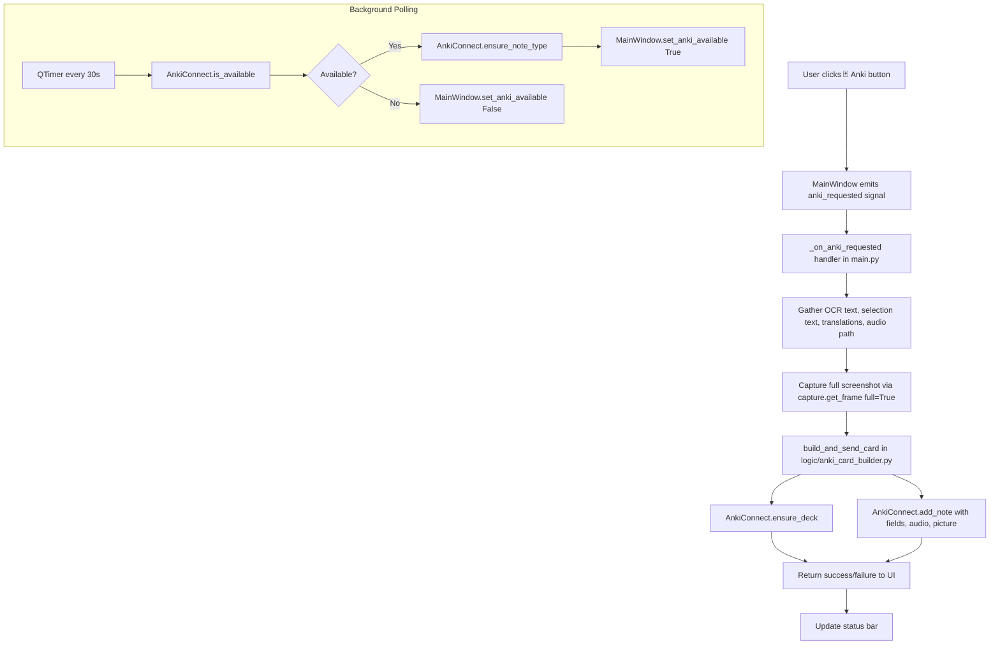

# Anki Integration Plan

## Overview

Add AnkiConnect-based flashcard creation to DesktopOCR. When the user clicks the Anki button, the app captures the current OCR text, selection text, translations, and a full-window screenshot, then sends them to Anki via AnkiConnect's HTTP API.

## Architecture



## Files to Create

### 1. `logic/anki_connect.py` — AnkiConnect API Client

**Class: `AnkiConnect`**

- `__init__(host="localhost", port=8765)` — stores host/port, builds base URL
- `async is_available() -> bool` — POSTs `{"action": "version", "version": 6}` with 2s timeout, returns `True` if response has numeric `result`
- `async ensure_deck(deck_name: str) -> bool` — POSTs `createDeck` action
- `async ensure_note_type() -> bool` — checks if `"DesktopOCR"` model exists via `modelNames`, creates it via `createModel` if not
- `async add_note(deck_name, fields, tags, audio=None, picture=None) -> int | None` — POSTs `addNote` action, returns note ID or None

**Key design decisions:**
- All methods catch all exceptions, log at WARNING with `[Anki]` prefix, never raise
- Use `aiohttp` if importable (try/except), fall back to `urllib.request` wrapped in `run_in_executor`
- The `createModel` call defines 7 fields: `Front`, `Back`, `TargetText`, `TargetTranslation`, `ContextText`, `ContextTranslation`, `Screenshot`
- CSS for the note type is minimal: `.card { font-family: sans-serif; font-size: 20px; } .target { font-size: 28px; font-weight: bold; } .context { font-size: 16px; color: #666; } .translation { color: #2a6; margin-top: 8px; } .context-translation { color: #888; font-size: 14px; }`
- Single card template: `Front: "{{Front}}"`, `Back: "{{FrontSide}}<hr>{{Back}}"`

### 2. `logic/anki_card_builder.py` — Card Assembly Logic

**Function: `async build_and_send_card(anki, capture, ocr_text, selection_text, ocr_translation, selection_translation, audio_path, config) -> bool`**

Logic flow:
1. Grab full screenshot via `await capture.get_frame(full=True)`, encode as PNG base64
2. Determine `target_text` — use `selection_text` if non-empty, else `ocr_text`
3. Build fields dict with `TargetText`, `TargetTranslation`, `ContextText`, `ContextTranslation`, `Screenshot` (as `` tag)
4. Build `Front` HTML based on `config["anki_front"]`:
   - `"screenshot"` → `{Screenshot}`
   - `"screenshot_selection"` → `{Screenshot}<br><div class='target'>{TargetText}</div>`
   - `"selection_only"` → `<div class='target'>{TargetText}</div>`
5. Build `Back` HTML based on `config["anki_back"]`:
   - `"full_with_context"` → full layout with target, translation, context, context-translation
   - `"selection_only"` → target + translation only
   - `"full_only"` → context + translation only
6. Build audio dict if `audio_path` provided and file exists
7. Build picture dict for the screenshot
8. Call `anki.ensure_deck()` then `anki.add_note()` with fields, tags, audio, and picture
9. Log success/failure, return `True`/`False`

**Config keys (from settings):**
- `anki_deck` (str, default `"DesktopOCR"`)
- `anki_tags` (str, default `"japanese, vn"`)
- `anki_front` (str, one of `"screenshot"`, `"screenshot_selection"`, `"selection_only"`)
- `anki_back` (str, one of `"full_with_context"`, `"selection_only"`, `"full_only"`)
- `anki_audio_side` (str, one of `"front"`, `"back"`, `"both"`)
- `anki_auto_translate` (bool, default `True`)

## Files to Modify

### 3. `main.py` — Settings Defaults + Wiring

**DEFAULT_SETTINGS additions:**
```python
"anki_enabled": False,
"anki_host": "localhost",
"anki_port": 8765,
"anki_deck": "DesktopOCR",
"anki_tags": "japanese, vn",
"anki_front": "screenshot",
"anki_back": "full_with_context",
"anki_audio_side": "front",
"anki_auto_translate": True,
```

**In `main()` function, after existing validator setup:**
1. Import `AnkiConnect` and `build_and_send_card`
2. Create `anki = AnkiConnect(host=..., port=...)`
3. Add `QTimer` (30s interval) that polls `anki.is_available()` and calls `window.set_anki_available()`
4. Connect `window.anki_requested` to `_on_anki_requested()` async handler
5. The handler:
   - Gets OCR text, selection text, translations from window
   - Gets last audio path from TTS manager
   - If auto_translate enabled and translations missing, fires concurrent translation calls
   - Calls `build_and_send_card()`
   - Updates status bar with result

### 4. `ui/main_window.py` — Signal + Accessors

**Add signal:**
```python
anki_requested = pyqtSignal()
```

**Add method:**
```python
def set_anki_available(self, available: bool):
    self.transcription_tray.set_anki_available(available)
```

**Add accessors (if not already present via transcription_tray):**
- `get_ocr_text()` → delegates to `self.transcription_tray.get_ocr_text()`
- `get_selection_text()` → delegates to `self.transcription_tray.get_selection_text()`
- `get_ocr_translation()` → returns `self.transcription_tray.get_ocr_translation()`
- `get_selection_translation()` → returns `self.transcription_tray.get_selection_translation()`

Note: `get_ocr_text()` and `get_selection_text()` already exist on `TranscriptionTray` (lines 338-342). We need to add `get_ocr_translation()` and `get_selection_translation()` to `TranscriptionTray` as well.

### 5. `ui/transcription_tray.py` — Anki Button

**Add Anki button next to Re-capture button:**
```python
self._anki_btn = QPushButton("🃏 Anki")
self._anki_btn.setFixedHeight(28)
self._anki_btn.setSizePolicy(QSizePolicy.Policy.Fixed, QSizePolicy.Policy.Fixed)
self._anki_btn.setEnabled(False)
self._anki_btn.setToolTip("Start Anki to enable")
self._anki_btn.clicked.connect(lambda: self.anki_requested.emit())
self._primary_buttons.append(self._anki_btn)
ocr_header.addWidget(self._anki_btn)
```

**Add signal:**
```python
anki_requested = pyqtSignal()
```

**Add method:**
```python
def set_anki_available(self, available: bool):
    self._anki_btn.setEnabled(available)
    self._anki_btn.setToolTip("Save to Anki" if available else "Start Anki to enable")
```

**Add accessors for translations:**
```python
def get_ocr_translation(self) -> str:
    return self._trans_text.toPlainText()

def get_selection_translation(self) -> str:
    # Currently there's no separate selection translation display
    # Return empty string for now — the full translation is the OCR translation
    return ""
```

### 6. `ui/side_menu.py` — Anki Settings Panel

**Add signals:**
```python
anki_enabled_changed = pyqtSignal(bool)
anki_deck_changed = pyqtSignal(str)
anki_tags_changed = pyqtSignal(str)
anki_front_changed = pyqtSignal(str)
anki_back_changed = pyqtSignal(str)
anki_audio_side_changed = pyqtSignal(str)
anki_auto_translate_changed = pyqtSignal(bool)
```

**Add collapsible "Anki Integration" section** (after Translation Options or AI Enhancements):
- Enable toggle: On/Off buttons → `anki_enabled_changed`
- Deck name: `QLineEdit` with placeholder "DesktopOCR" → `anki_deck_changed`
- Tags: `QLineEdit` with placeholder "japanese, vn" → `anki_tags_changed`
- Front content: `QComboBox` with options "Screenshot only", "Screenshot + Selection", "Selection text only" → `anki_front_changed`
- Back content: `QComboBox` with options "Full text + Context", "Selection only", "Full text only" → `anki_back_changed`
- Audio placement: `QComboBox` with options "Front", "Back", "Both" → `anki_audio_side_changed`
- Auto-translate on save: On/Off toggle → `anki_auto_translate_changed`

**Add setter methods** (following existing pattern like `set_openai_validator_enabled`):
- `set_anki_enabled(enabled, *, emit_signal=False)`
- `set_anki_deck(deck)`
- `set_anki_tags(tags)`
- `set_anki_front(value)`
- `set_anki_back(value)`
- `set_anki_audio_side(value)`
- `set_anki_auto_translate(enabled, *, emit_signal=False)`

**Update `_on_reset()`** to reset Anki settings to defaults.

### 7. `tts/manager.py` — Track Last Audio Path

**Add to `__init__`:**
```python
self.last_audio_path: str | None = None
```

**Modify `speak()`** to store the path of the generated audio file if the backend provides it. This requires checking if the active backend exposes a `last_audio_path` attribute after speaking.

Alternatively, simpler approach: have the `speak()` method return the audio path, or have each backend store `last_audio_path`. Since backends may not all support this, we can add a `last_audio_path` property to `TTSManager` that checks the active backend.

## Implementation Order

The steps should be implemented in this order to minimize breakage:

1. **`logic/anki_connect.py`** — standalone module, no dependencies on other changes
2. **`logic/anki_card_builder.py`** — depends only on `anki_connect.py` and `capture.py`
3. **`main.py` DEFAULT_SETTINGS** — add new keys (no behavioral change yet)
4. **`ui/transcription_tray.py`** — add Anki button, signal, accessors
5. **`ui/main_window.py`** — add signal, delegate methods
6. **`ui/side_menu.py`** — add Anki settings section
7. **`tts/manager.py`** — track last audio path
8. **`main.py` wiring** — add AnkiConnect init, QTimer, handler, connect signals

## Key Constraints

- Do NOT modify `engine_manager.py`, `ocr_engine.py`, `tensor_utils.py`, `capture.py`, or `capture_pipeline.py` (except optional `anki_connect` param to `CapturePipeline.__init__` if needed — but the plan avoids this)
- `aiohttp` is a soft dependency — wrap import in try/except with urllib fallback
- All Anki logic lives in `logic/anki_connect.py` and `logic/anki_card_builder.py`
- Never raise exceptions from Anki code — catch all, log, return safe values
- Log all AnkiConnect errors at WARNING level with `[Anki]` prefix
- The Anki button starts disabled and only enables when AnkiConnect responds to `is_available()`
