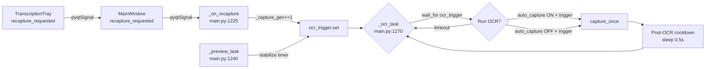

# Re-capture Button & Auto-capture Fix — Revised Plan

## What was changed (ONLY main.py)

Only [`main.py`](main.py) was modified. These files were **NOT** touched:

| File | State |
|------|-------|
| [`core/capture.py`](core/capture.py) | Unchanged |
| [`core/capture_pipeline.py`](core/capture_pipeline.py) | Unchanged |
| [`core/ocr_engine.py`](core/ocr_engine.py) | Unchanged — `vn_stable_mode` is [`_VN_STABLE_MODE`](core/ocr_engine.py:27), env var `DESKTOCR_VN_STABLE_MODE` (default `"1"`), controls `DET_BOX_THRESHOLD` |
| Any other file | Unchanged |

---

## Current state of main.py (changes already applied)

### [1] `_on_recapture()` — lines 1225-1235
```python
def _on_recapture():
    nonlocal _capture_gen, _recapture_pending
    if hwnd is None:
        ...
    _capture_gen += 1
    _recapture_pending = True
    ocr_trigger.set()
```
✅ Correct — bumps generation to discard in-flight OCR, flags as recapture.

### [2] `_preview_task()` — static-frame fix, lines 1262-1267
```python
else:
    # Identical frame (MD5 match)
    if settings_state["auto_capture"] and selection_ready:
        if _stabilize_task is None or _stabilize_task.done():
            _stabilize_task = asyncio.create_task(_trigger_after_stabilize())
```
✅ Correct — creates stabilize tasks even on static/identical frames.

### [3] Auto and manual mode trigger waits — lines 1279-1294
```python
if settings_state["auto_capture"]:
    try:
        await asyncio.wait_for(ocr_trigger.wait(), timeout=0.5)
        ocr_trigger.clear()
    except asyncio.TimeoutError:
        continue
    _capture_gen += 1
    this_gen = _capture_gen
else:
    try:
        await asyncio.wait_for(ocr_trigger.wait(), timeout=1.5)
        ocr_trigger.clear()
    except asyncio.TimeoutError:
        continue
    this_gen = None
```
✅ Correct — both modes now listen for `ocr_trigger` instead of blind sleeps.

---

## The stall bug — post-OCR trigger consumption

### Root cause: post-OCR wait [steals](main.py:1341-1348) stabilize-timer triggers

```python
# Post-OCR wait (CURRENT — BROKEN)
try:
    await asyncio.wait_for(ocr_trigger.wait(), timeout=1.5)   # catches next trigger
except asyncio.TimeoutError:
    pass
if _recapture_pending:
    _recapture_pending = False   # keep event set for main consumer
else:
    ocr_trigger.clear()          # ← CONSUMES the stabilize trigger!
```

**Sequence of events leading to stall:**

```
Time │ Event
─────┼─────────────────────────────────────────────────────
0.0  │ Stabilize task S1 created
0.5  │ S1 fires → ocr_trigger.set()
0.5  │ OCR task: wait_for returns, clear(), _capture_gen=1, runs OCR
0.5  │ Preview creates S2 (S1 just finished)
0.7  │ OCR done → post-OCR wait: wait_for(ocr_trigger, timeout=1.5)
1.0  │ S2 fires → ocr_trigger.set()
1.0  │ Post-OCR wait CATCHES it! _recapture_pending=False → clear()
     │   ↑ TRIGGER CONSUMED — meant for next OCR, stolen by cooldown wait
1.0  │ Main consumer: wait_for(ocr_trigger, timeout=0.5) — NOTHING set!
     │ Preview creates S3
1.5  │ Main consumer TIMES OUT → continue → back to wait_for
1.5  │ S3 fires → ocr_trigger.set()
1.5  │ Main consumer catches S3 → runs OCR → post-OCR wait steals S4
     │ Pattern repeats with ~50% of triggers wasted
```

On **every cycle**, the post-OCR wait consumes the next stabilize trigger. The main consumer then spin-waits 0.5s (timeout) before the next trigger is ready. This creates ~1.5-2s per cycle instead of ~0.8s, but doesn't fully stall.

### What causes the COMPLETE stall after 3 cycles

The `_ocr_task` coroutine has **no top-level exception handler** — any unhandled exception (e.g., from [`window.set_ocr_boxes()`](ui/main_window.py:307) or [`window.set_ocr_canvas_frames()`](ui/main_window.py:313)) silently kills the task:

```python
async def _ocr_task():
    nonlocal _capture_gen, _recapture_pending
    while not stop_event.is_set():
        # ... NO try/except around the entire body ...
        res = await pipeline.capture_once(...)
        if res is not None:
            window.set_ocr_boxes(boxes)          # ← could raise!
            window.set_ocr_canvas_frames(...)     # ← could raise!
        ...
```

If this task crashes, the preview task keeps running, creating stabilize tasks and setting `ocr_trigger` — but nobody consumes it. The app appears "stalled."

---

## Fix plan

### Change A — Replace trigger-stealing post-OCR wait with simple sleep

**File:** [`main.py`](main.py), lines 1337-1348

Replace the `wait_for(ocr_trigger) + conditional clear` with a simple cooldown sleep:

**Before:**
```python
try:
    await asyncio.wait_for(ocr_trigger.wait(), timeout=1.5)
except asyncio.TimeoutError:
    pass
if _recapture_pending:
    _recapture_pending = False
else:
    ocr_trigger.clear()
```

**After:**
```python
# Simple cooldown — does NOT touch ocr_trigger, so stabilize / Re-capture
# triggers are preserved for the main consumer at the top of the loop.
# The Re-capture button can still preempt via _capture_gen bump.
await asyncio.sleep(0.5)
```

This ensures:
- Stabilize-timer triggers are never consumed by the cooldown
- Re-capture button's `ocr_trigger.set()` persists for the main consumer
- `_recapture_pending` flag is no longer needed (simplification)

### Change B — Add exception safety to `_ocr_task`

**File:** [`main.py`](main.py), around lines 1270-1348

Wrap the entire while-loop body in try/except to prevent silent crashes:

**Before:**
```python
async def _ocr_task():
    nonlocal _capture_gen, _recapture_pending
    while not stop_event.is_set():
        if not streaming_enabled:
            ...
```

**After:**
```python
async def _ocr_task():
    nonlocal _capture_gen, _recapture_pending
    while not stop_event.is_set():
        try:
            if not streaming_enabled:
                ...
            # ... rest of body ...
        except Exception as exc:
            logger.error("[OCR] Task crashed: %s", exc, exc_info=True)
            await asyncio.sleep(1.0)  # back-off before retry
```

This prevents the task from silently dying and logs the actual error for debugging.

### Change C — Remove `_recapture_pending` (simplification)

Since the post-OCR wait no longer touches `ocr_trigger`, the `_recapture_pending` flag is unnecessary:

- Remove declaration at [line 1222](main.py:1222)
- Remove from `nonlocal` in `_on_recapture` at [line 1226](main.py:1226)
- Remove `_recapture_pending = True` at [line 1234](main.py:1234)
- Remove from `nonlocal` in `_ocr_task` at [line 1271](main.py:1271)

The `_capture_gen += 1` alone is sufficient — it invalidates in-flight OCR results, and the Re-capture `ocr_trigger.set()` is now never consumed by the cooldown.

### Change D — Verify `_stabilize_task.cancel()` doesn't leak

When `full_frame is not None` at [line 1259](main.py:1259), the old stabilize task is cancelled. The cancelled task's `CancelledError` is silently swallowed by Python 3.11+. **No change needed** — this is correct behavior.

---

## Behavior matrix (after fix)

| Scenario | Expected behavior |
|----------|-------------------|
| auto_capture=ON, static content | Preview creates stabilize tasks every 0.5s → OCR cycles continuously every ~0.8-1.0s |
| auto_capture=ON, frame changes | Preview cancels old stabilize task, creates new one → OCR fires after 0.5s stabilize delay |
| auto_capture=ON, Re-capture during OCR | `_capture_gen` bumped → stale result discarded → fresh OCR runs after current one finishes |
| auto_capture=ON, Re-capture during cooldown | `ocr_trigger` already set → main consumer picks it up immediately after 0.5s sleep |
| auto_capture=OFF | `wait_for(ocr_trigger, timeout=1.5)` → only Re-capture button triggers OCR |
| auto_capture=OFF, Re-capture during cooldown | Same as auto — trigger preserved, picked up after sleep |

---

## Files to modify

| File | Changes |
|------|---------|
| [`main.py`](main.py) | Lines 1222, 1226, 1234, 1271, 1337-1348 — see Changes A, B, C above |

No other files need modification.

---

## Signal chain (Mermaid)



---

## Why this approach is better

1. **No trigger stealing** — the cooldown is a blind `sleep()` that doesn't touch `ocr_trigger`
2. **Simpler** — removes `_recapture_pending` flag entirely
3. **Exception-safe** — wrapped body logs crashes instead of silently dying
4. **Responsive** — Re-capture sets `ocr_trigger` which persists until the main consumer picks it up
5. **Consistent timing** — every OCR cycle follows the same path regardless of source
